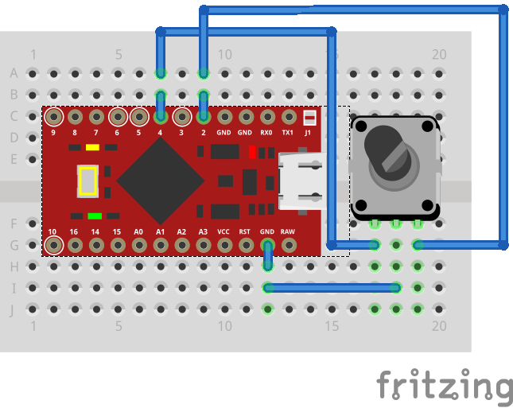
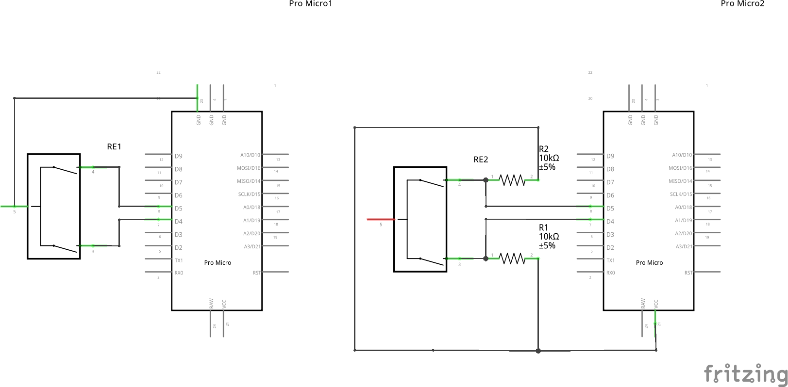

# Stuff for my "Let's Split"

Featuring:

- Custom highlights (including custom knight-rider-like one which I've named DMC-12 by mistake.)
- LOW_ESC key (LOWER on hold, ESC on tap.)
- Rotary encoder knob for horizontal/vertical scrolling & volume control.

# Knob inscructions

## V1

I've used pins 4 & 5 (PD4 & PC6) to read digital value from the rotary encoder because Let's Split doesn't use them (Split keyboards FTW! Moar precious free pins!)

See `knob.c` for implementation & usage info.

**Note:** If you scroll too fast, the scroll becomes laggy. Unfortunately there's no way to deal with this as matrix_scan_user isn't called frequently enough and some signals from encoder are simply lost.

## V2

**Note:** Seems like port PD4 has an ADC (ADC8) attached. I've added a `knob_v2` that does this, but used port D1 (pin 2). Note that it uses a different pin.

# Schematics

- Left image: V1 without pull-up (this is the variant that I implemented - most AVRs have internal pull-up resistors.)
- Right image: V2 with pull-up via 2 x 10 kOhm resistors (you can use this if your board/pin doesn't have internal pull-up.)
- V2 - same as left image, but wire on PD4 (pin 4) should be connected to PD1 (pin 2.)

